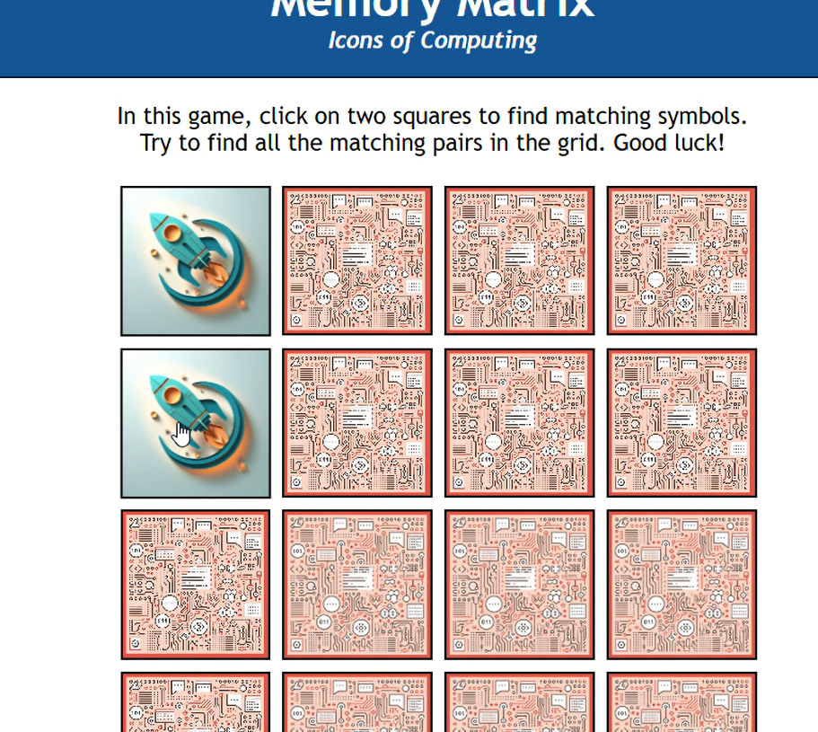
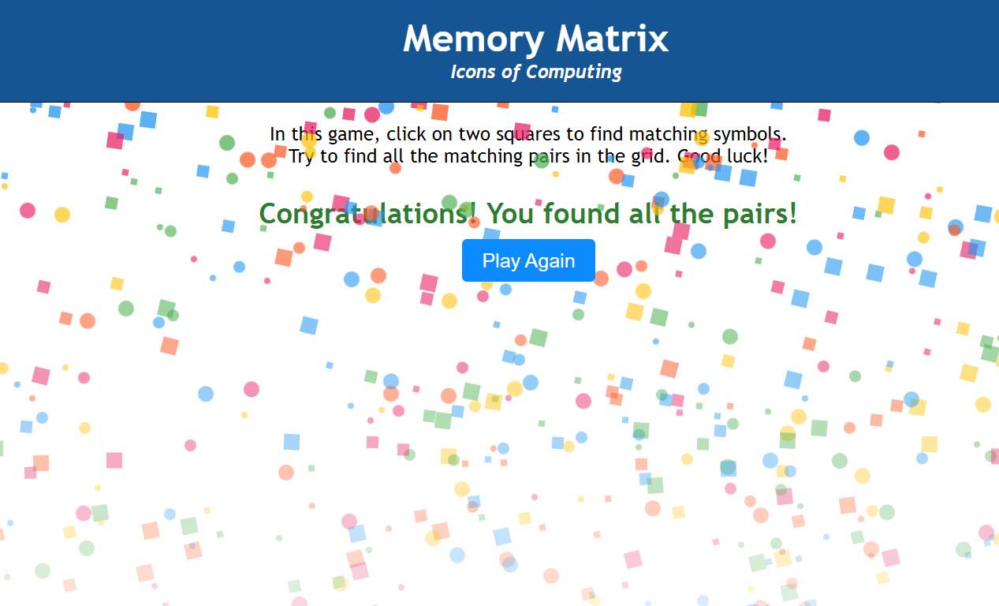

# Memory Matrix Card Game

## 🎮 About the Game

Memory Matrix is a fun and interactive card-matching game designed to test and improve memory skills. The goal of the game is to match pairs of cards within a limited number of moves.

## 🚀 Features

- 🎨 Engaging and interactive UI
- 🔀 Randomized card placements for replayability
- 🎞️ Smooth animations and transitions
- 🏆 Score tracking system
- 📱 Responsive design for various screen sizes

## 📸 Game Preview

### 🖼️ Screenshot 1: Game Start


### 🖼️ Screenshot 2: Matching Cards



### 🖼️ Screenshot 3: Game Completed



## 🎯 How to Play

1. Start the game and a grid of facedown cards will appear.
2. Click on a card to reveal its value.
3. Click on a second card to try and find a match.
4. If the two cards match, they remain face up; otherwise, they flip back over.
5. Continue matching pairs until all cards are revealed.
6. Try to complete the game in the fewest moves possible!

## 🛠️ Technologies Used

- **Frontend:** HTML, CSS, JavaScript
- **Logic Implementation:** JavaScript

## 📥 Installation

1. Clone the repository:
   ```sh
   git clone https://github.com/11Yashyadav/Memory-Matrix-card-Game-.git
   ```
2. Navigate to the project folder:
   ```sh
   cd Memory-Matrix-card-Game-
   ```
3. Open `index.html` in your browser to start playing.

## 💡 Future Improvements

- 🔊 Add sound effects and background music.
- 🎚️ Implement different difficulty levels.
- ⏳ Add a timer-based challenge mode.
- ⚡ Optimize animations for smoother gameplay.

## 🤝 Contributing

Contributions are welcome! Feel free to fork the repository and submit pull requests.
